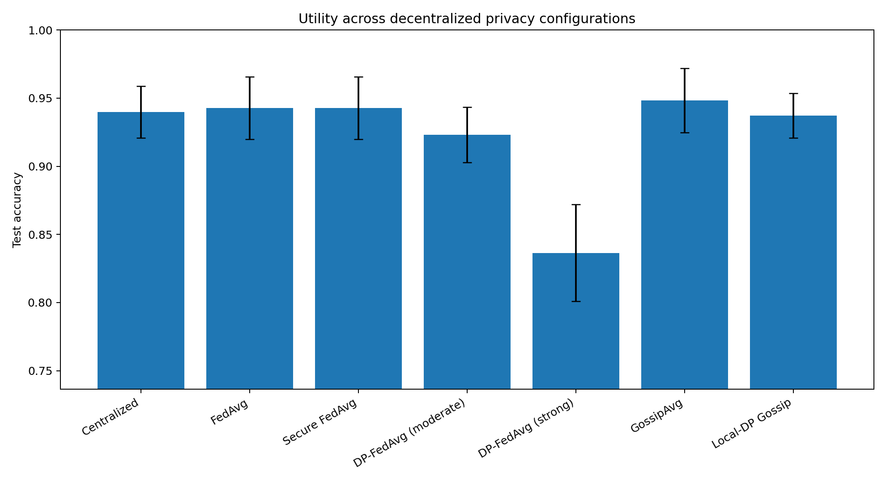
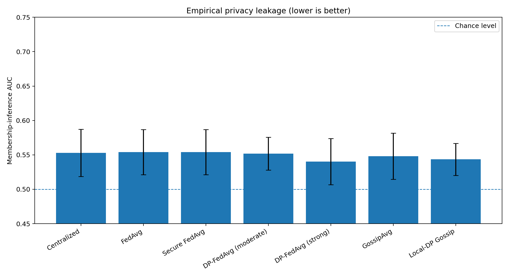
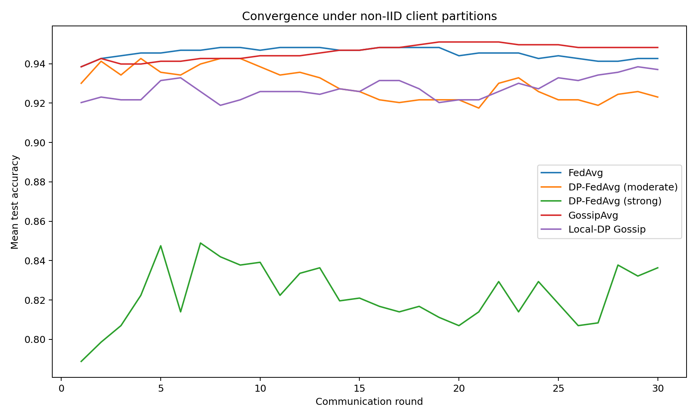
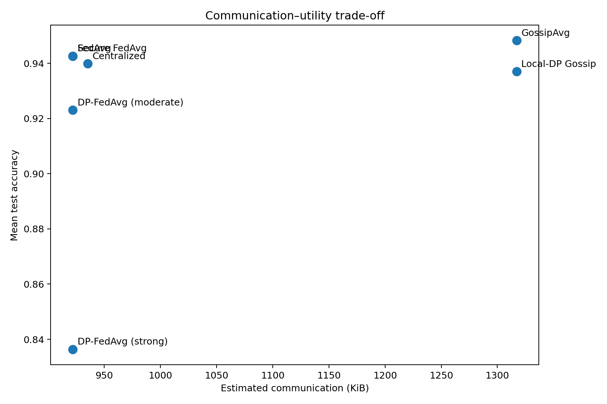

# Investigating Privacy-Preserving Machine Learning Frameworks for Decentralized Data Environments

## Abstract

This project investigates how architectural and privacy choices affect machine-learning utility, measurable privacy leakage, communication cost, and deployment complexity when data is distributed across independent clients. A reproducible benchmark compares centralized training, Federated Averaging (FedAvg), an algebraic secure-aggregation simulation, central-noise DP-FedAvg variants, serverless ring-gossip learning, and locally perturbed gossip learning. Experiments use 10 non-IID clients created with a Dirichlet label partition and are repeated over five random seeds.

The strongest mean test accuracy was achieved by **GossipAvg** at **94.83%**. The lowest measured membership-inference AUC was produced by **DP-FedAvg (strong)** at **0.5402**. These results reinforce two important conclusions: keeping raw data local is valuable but does not by itself provide a formal privacy guarantee, and stronger perturbation can reduce empirical leakage while degrading utility.

## 1. Research Questions

1. How closely can decentralized training approach centralized model utility under non-IID data?
2. What privacy leakage remains when raw records never leave client devices?
3. How do secure aggregation and Gaussian perturbation affect the utility–privacy trade-off?
4. When is coordinator-based federated learning preferable to serverless gossip learning?
5. Which current framework is the best engineering fit for research, organizational deployment, or governed remote data science?

## 2. System and Threat Model

The benchmark models 10 organizations or devices, each retaining a private local shard. The adversary may observe a released global model and attempt membership inference. For standard FedAvg, the coordinator is assumed honest-but-curious and can theoretically inspect individual client updates. The secure-aggregation experiment masks weighted updates so that the aggregate remains unchanged while individual contributions cancel algebraically. This simulation demonstrates protocol behavior but is **not** a cryptographic implementation.

The differential-privacy experiments clip updates and add Gaussian noise. They are designed for controlled comparison only. The project does **not** claim a formal `(epsilon, delta)` guarantee because it does not include a production privacy accountant, Poisson sampling assumptions, or a complete neighboring-dataset proof. Framework integrations such as Flower DP strategies, TensorFlow Federated DP aggregators, or Opacus should be used when a formal privacy budget is required.

## 3. Methodology

### 3.1 Dataset and Partitioning

The experiments use scikit-learn's breast-cancer diagnostic dataset. Training features are standardized using statistics fitted only on the training split. To create a controlled privacy stress test, 250 independent Gaussian nuisance features are appended to both splits; these features contain no intended label signal but increase capacity for memorization. Client shards are produced with a Dirichlet concentration parameter of 0.45, creating realistic class imbalance and non-IID heterogeneity. Every client receives at least 12 examples.

### 3.2 Compared Methods

- **Centralized:** all training records are pooled at one server.
- **FedAvg:** selected clients train locally and transmit model updates for weighted averaging.
- **Secure FedAvg:** FedAvg with pairwise random masks whose sum cancels at aggregation.
- **DP-FedAvg (moderate/strong):** client updates are clipped; Gaussian noise is added to the aggregate.
- **GossipAvg:** clients train locally and synchronously average with two ring neighbors.
- **Local-DP Gossip:** clipped updates are perturbed at each client before peer-to-peer exchange.

### 3.3 Metrics

Utility is measured with test accuracy, F1, ROC-AUC, and log loss. Privacy leakage is estimated with a loss-threshold membership-inference attack; 0.5 AUC is chance level and larger values indicate more separability between members and non-members. Communication is estimated from transmitted model-vector bytes; centralized data upload is counted as raw-data communication.

## 4. Results

| method               | accuracy        |     f1 |   roc_auc |   attack_auc |   communication_kib |   time_seconds |
|:---------------------|:----------------|-------:|----------:|-------------:|--------------------:|---------------:|
| Centralized          | 0.9399 ± 0.0189 | 0.9523 |    0.9885 |       0.5529 |               935.2 |          0.041 |
| FedAvg               | 0.9427 ± 0.0229 | 0.9546 |    0.9896 |       0.554  |               922   |          0.124 |
| Secure FedAvg        | 0.9427 ± 0.0229 | 0.9546 |    0.9896 |       0.554  |               922   |          0.126 |
| DP-FedAvg (moderate) | 0.9231 ± 0.0204 | 0.9377 |    0.9802 |       0.5519 |               922   |          0.126 |
| DP-FedAvg (strong)   | 0.8364 ± 0.0355 | 0.8592 |    0.9301 |       0.5402 |               922   |          0.127 |
| GossipAvg            | 0.9483 ± 0.0235 | 0.9588 |    0.9891 |       0.548  |              1317.2 |          0.141 |
| Local-DP Gossip      | 0.9371 ± 0.0164 | 0.9495 |    0.9789 |       0.5435 |              1317.2 |          0.146 |









### 4.1 Main Findings

- Moderate DP-FedAvg changed membership-attack AUC by **-0.0021** relative to FedAvg in this small benchmark. Because attack estimates vary across seeds, this should be interpreted as empirical evidence, not a privacy proof.
- Strong DP-FedAvg changed accuracy by **-0.1063** relative to FedAvg, illustrating the cost of stronger perturbation.
- Local-DP Gossip changed accuracy by **-0.0112** relative to unperturbed GossipAvg. Local noise is applied before sharing, so it protects against peers but generally introduces more utility pressure than aggregate noise.
- Secure FedAvg should have nearly identical utility to FedAvg because masking cancels before the aggregate update is applied. Its benefit is update confidentiality, not model-level differential privacy.
- The serverless gossip topology removes the central aggregation dependency, but it sends models across neighbor links every round and offers different trust and failure characteristics.

## 5. Framework Comparison

| framework            | primary_focus                                                 | model_ecosystem                                    | simulation                                   | differential_privacy                                       | secure_aggregation                  | governance                                                     | best_fit                                                            |
|:---------------------|:--------------------------------------------------------------|:---------------------------------------------------|:---------------------------------------------|:-----------------------------------------------------------|:------------------------------------|:---------------------------------------------------------------|:--------------------------------------------------------------------|
| Flower               | Framework-agnostic federated learning research and deployment | PyTorch, TensorFlow, JAX, scikit-learn and others  | Scalable simulation runtime                  | Built-in central and local DP mechanisms (preview)         | Built-in SecAgg and SecAgg+         | Application and federation configuration                       | Fast prototyping that can grow into multi-node deployment           |
| TensorFlow Federated | Research-oriented federated computations in TensorFlow        | TensorFlow / Keras                                 | Federated simulation datasets and runtimes   | DP aggregators and TensorFlow Privacy integration          | Secure-sum aggregators              | Algorithmic composition rather than data-access governance     | Custom FL algorithms and rigorous TensorFlow experiments            |
| OpenFL               | Cross-silo federated learning for organizations               | Backend-agnostic, including PyTorch and TensorFlow | Local and federated runtimes                 | Opacus-based options and privacy reporting                 | TaskRunner and Workflow API support | PKI, mTLS, collaborator authorization and plans                | Institutional collaborations with explicit infrastructure security  |
| PySyft               | Governed remote data science on private data assets           | Python code execution over governed assets         | Datasite-oriented development with mock data | Policy and release workflows; mechanism depends on study   | Not its sole design center          | Strong request, approval, dataset and result-release workflows | Data-access governance where researchers must not see raw data      |
| DecentraPrivML-Bench | Transparent educational benchmark and framework selection     | NumPy / scikit-learn reference model               | Single-machine non-IID client simulation     | Clipping plus Gaussian-noise experiments; no epsilon claim | Algebraic pairwise-mask simulation  | Documented threat model; not a deployment control plane        | Reproducible comparison, teaching and pre-framework experimentation |

### Selection Guidance

**Flower** is the strongest general-purpose starting point when the goal is to prototype in familiar ML libraries and later move to multi-node federated deployment. Its current documentation includes central/local differential privacy and SecAgg/SecAgg+ support, although privacy features may require careful production validation.

**TensorFlow Federated** is best when the research question centers on custom federated algorithms, typed federated computations, or TensorFlow-native DP and secure aggregation.

**OpenFL** is attractive for cross-silo institutional collaborations requiring PKI, mTLS, collaborator authorization, workflow plans, secure aggregation, and privacy assessment.

**PySyft** addresses a somewhat different problem: controlled remote analysis and governance of private data assets, including requests, approvals, mock data, and result release. It is suitable when researchers should execute approved code without receiving the underlying dataset.

## 6. Limitations

The benchmark uses one tabular binary-classification dataset and a linear model. The number of clients is small, availability is synchronous, and network latency is simulated only through byte counts. The membership attack is intentionally simple. The secure-aggregation mechanism is algebraic rather than cryptographic, and the DP mechanisms omit formal accounting. Therefore, the results support framework selection and experimental reasoning but must not be treated as a production privacy certification.

## 7. Recommended Extension Plan

A production-oriented continuation should replace the reference simulator with Flower or OpenFL, use a formal user-level accountant, enable real SecAgg+, add client dropout and malicious-update defenses, test larger datasets and neural networks, and run stronger privacy attacks such as LiRA or gradient inversion. For a data-governance study, a parallel PySyft deployment can evaluate approval latency, result-release policies, and researcher usability.

## 8. Reproducibility

Run:

```bash
python -m venv .venv
source .venv/bin/activate  # Windows: .venv\Scripts\activate
pip install -e .[dev]
python -m decentraprivml.cli run --config configs/default.yaml --output results
python scripts/generate_report.py
pytest
```

All raw runs, aggregate summaries, client-partition statistics, round histories, configuration, plots, and metadata are included in the repository.

## References

See `reports/references.md` for official framework documentation and foundational papers.
